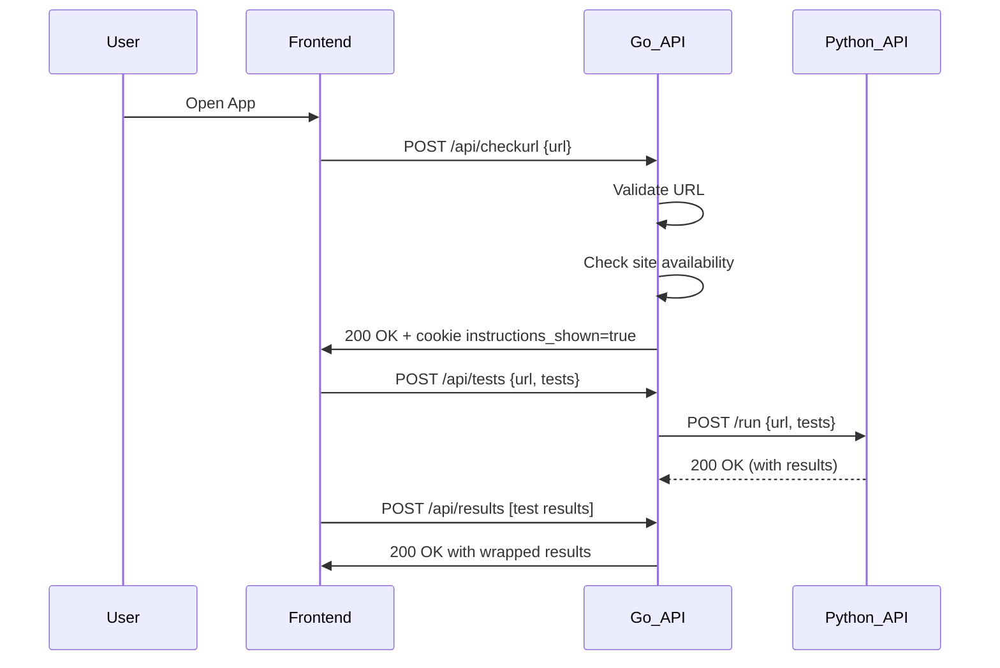
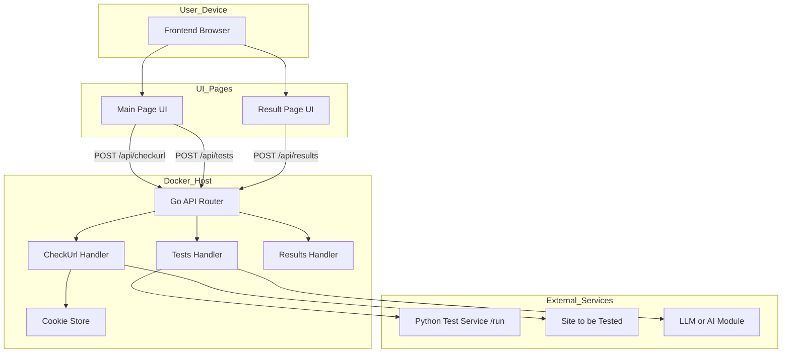

# Inno Test

## Development

### Kanban board

We use a GitLab Issue Board with the following columns:

- To Do  
  _Entry criteria:_
    - Issue is estimated
    - Issue uses the defined template
    - Label To Do is applied

- In Progress  
  _Entry criteria:_
    - A new branch is created for the issue
    - Assigned to a team member

- In Review  
  _Entry criteria:_
    - Merge request is created
    - Reviewer is assigned

- Ready to deploy  
  _Entry criteria:_
    - Review is complete
    - MR is approved

- User Testing  
  _Entry criteria:_
    - Feature is deployed to staging
    - Customer is informed and test scenario is ready

- Done  
  _Entry criteria:_
    - All acceptance criteria are met
    - Feedback (if any) is resolved
    - Issue is closed

### Git workflow

Each developer created custom CI Pipeline files in the .github/workflows directory.
More details in "Build and deployment" section

We follow a simplified GitHub Flow.
- All development is done on other branches from `main`.
- Branches are named according to developer tasks

**Issue templates**: We use templates for:
- User Story
- Bug Report
- Technical Task

  TODO: IMPLEMENT TEMPLATES AND ADD A LINK TO THEM HERE

**Commit format**:  
Each developer describes what have he done in the commit

**Pull Requests**:
https://github.com/cQu1x/Autotester/pulls?q=is%3Apr+is%3Aclosed

**Code review**:
Each pull request must be reviewed by at least one other team member before merging.

**Git workflow diagram**

TODO: IMPLEMENT GITGRAPH DIAGRAM

## Quality assurance

### Quality attribute scenarios

See
```
docs/quality-assurance/quality-attribute-scenarios.md
```


### Automated tests

Flutter:
- Used in-build flutter tools for testing
- Implemented unit-tests for widgets
- `frontend/test` contains all tests

## Build and deployment

### Continuous integration

Flutter CI:
- Link to CI: https://github.com/cQu1x/Autotester/blob/main/.github/workflows/flutter_ci.yml
- Downloads flutter
- Runs tests
- Creates build for web application (important for code updates)

Golang:
 - Used in-build golang tools for testing
 - Implemented unit test for cookies and validators. Implemented integration tests for handlers
 - `tests/` contains all tests

Golang CI:
 - Link to CI: https://github.com/cQu1x/Autotester/actions/workflows/go-ci.yml
 - Downloads Golang
 - Runs tests and linting

Python:
 - Used python libraries (pytest) for testing
 - Implemented tests for parser and LLM-connection
 - `/test_1.py` contains all tests

Python CI:
 - Link to CI: https://github.com/cQu1x/Autotester/actions/workflows/python-ci.yml
 - Downloads Python
 - Runs tests


## Architecture

### Project Structure (backend)

Project is built using clean separation of concerns:

```text
internal/
├── cookies/      # Cookie management utilities
├── domain/       # Shared DTOs and structs (UrlRequest, APIResponse, Result)
├── handlers/     # HTTP API handlers for /checkurl, /tests, /results
├── middleware/   # CORS, logging, panic recovery
├── routes/       # Router setup
├── util/         # URL validation and site availability checks
```
### Request Flow

#### 1. POST /api/checkurl

- Input: JSON object containing a single key `url`
- The handler performs the following steps:
  - Reads and parses the request body
  - Validates the format of the URL
  - Checks if the site is reachable using the internal `SiteChecker`
  - If reachable, sets a cookie named `instructions_shown=true` valid for 7 days
- Output: JSON response with status `success` and a flag `ready_for_tests = true`

---

#### 2. POST /api/tests

- Input: JSON object with `url` and a list of `tests`
- The handler performs the following steps:
  - Reads the incoming request body
  - Forwards the request to the external Python API via POST to `{PythonPath}/run`
  - Uses `application/json` as content type
- Output: Responds with `200 OK` if forwarding is successful, otherwise an error code

---

#### 3. POST /api/results

- Input: JSON array of test result objects
- Each result object contains:
  - Test name
  - Boolean result (pass/fail)
- The handler performs the following steps:
  - Reads and parses the request body
  - Validates the JSON structure
  - Wraps the results in a standardized response format
- Output: JSON response with status `success` and the list of received test results


### Static view
https://miro.com/app/board/uXjVIghvg_g=/?share_link_id=709888351142
### Dynamic view
###  Sequence Diagram



### Deployment view



